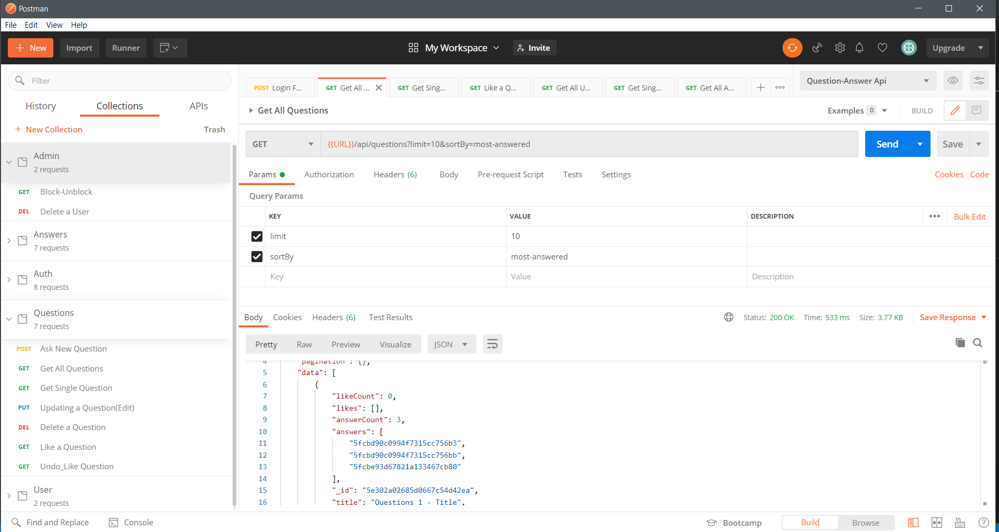

# question-answer-rest-api

# To Run This Project

To get the Node server running locally:

- Clone this repo
- `npm install` to install all required dependencies
- Create MongoDb Cluster and Get Connection MongoDb URI
- Set environment variables in `config.env` under `./config/env`
  * Set `MONGO_URI = <YOUR_MONGO_URI>`
  * Set `JWT_SECRET_KEY = <YOUR_SECRET_KEY>`
  * Set `SMTP_EMAIL=<YOUR_GMAIL_EMAIL>`
  * Set `SMTP_PASS=<YOUR_GMAIL_PASSWORD>`
- `node dummy-generator.js --import` to load dummy data to database
- `npm run dev` to start the local server

# Code Overview

## Dependencies

- [expressjs](https://github.com/expressjs/express) - The server for handling and routing HTTP requests
- [jsonwebtoken](https://github.com/auth0/node-jsonwebtoken) - For generating JWTs used by authentication
- [mongoose](https://github.com/Automattic/mongoose) - For modeling and mapping MongoDB data to JavaScript 
- [slugify](https://github.com/simov/slugify) - For encoding titles into a URL-friendly format
- [bcryptjs](https://github.com/dodo/node-slug) - Hashing Password
- [dotenv](https://github.com/motdotla/dotenv) - Zero-Dependency module that loads environment variables
- [multer](https://github.com/expressjs/multer) - Node.js middleware for uploading files
- [nodemailer](https://github.com/nodemailer/nodemailer) - Send e-mails from Node.js

## Application Structure

- `server.js` - The entry point to the application. This file defines the express server and connects it to MongoDB using mongoose. It also inncludes the routes which will be using in the application.
- `config/` - This folder contains configuration for central location environment variables and other configurations.
- `routes/` - This folder contains the route definitions (answer, question etc. ) for the API.
- `models/` - This folder contains the schema definitions for the Mongoose models (User, Question).
- `controllers/` - This folder contains controllers for the API.
- `public/` - This folder contains static files for the API.
- `middlewares/` - This folder contains middlewares for the API.
- `helpers/` - This folder contains helper functions for adapting 3rd party libraries for the API.
- `dummy/` - This folder contains dummy data created by dummy-generator.js file for the database.

## Error Handling

In `middlewares/errors/errorHandler.js`,an error-handling middleware is defined for handling the Mongoose's and the apllication's errors.

## Authentication

Requests are authenticated using the `Authorization` header and value `Bearer: {{token}}`. with a valid JWT. 

Express middlewares are defined in `middlewares/authorization/auth.js` that can be used to authenticate requests. The `required` middlewares returns `401` or `403`.

Detailed information can be found in [this specifications](./question-answer-specifications.md).

## Project ScreenShot :point_down:

